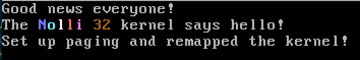
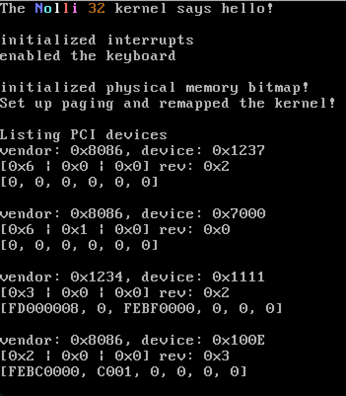

# Nolli OS
A simple, light-hearted Bootloader/OS

## Dependencies
+ nasm
+ clang
+ ld (this is specified in the build.sh, may need to be built with x-tools)
+ dd
+ qemu

1. ```./build.sh```
2. ```qemu-system-x86_64 nolli.bin```
3. Sheer joy




